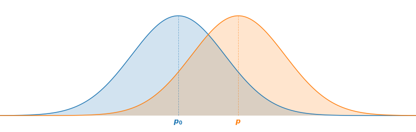
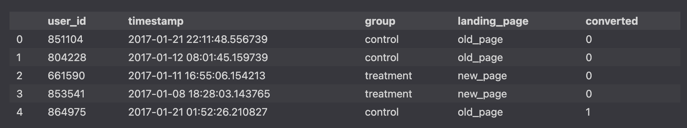

# A/B Testing Web Page design

For our data, we’ll use a [dataset from Kaggle](https://www.kaggle.com/zhangluyuan/ab-testing?select=ab_data.csv) which contains the results of an A/B test on what seems to be 2 different designs of a website page (old_page vs. new_page).

Let’s imagine you work on the product team at a medium-sized online e-commerce business. The UX designer worked really hard on a new version of the product page, with the hope that it will lead to a higher conversion rate. The product manager (PM) told you that the current conversion rate is about 13% on average throughout the year, and that the team would be happy with an increase of 2%, meaning that the new design will be considered a success if it raises the conversion rate to 15%.
Before rolling out the change, the team would be more comfortable testing it on a small number of users to see how it performs, so you suggest running an A/B test on a subset of your user base users.

we are interested in capturing the `conversion rate`. A way we can code this is by each user session with a binary variable:

* `0` - The user did not buy the product during this user session
* `1` - The user bought the product during this user session

There are 294478 rows in the DataFrame, each representing a user session, as well as 5 columns :
* `user_id` - The user ID of each session
* `timestamp` - Timestamp for the session
* `group` - Which group the user was assigned to for that session {control, treatment}
* `landing_page` - Which design each user saw on that session {`old_page`, `new_page`}
* `converted` - Whether the session ended in a conversion or not (binary, `0`=not converted, `1`=converted)

